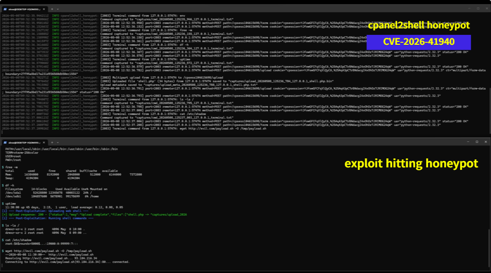

# cPanel2Shell Honeypot


A Rust honeypot that simulates a vulnerable cPanel/WHM instance for CVE-2026-41940 (cPanel2Shell authentication bypass).

## Interface



## Overview

This honeypot emulates the response sequence used by cPanel2Shell vulnerability scanners:

1. Returns a session cookie with the required comma-delimited format
2. Redirects authenticated requests to a session token path
3. Serves the `msg_code:[expired_session]` marker on token endpoints

Attackers who proceed past the initial probe are dropped into a fake bash shell backed by an in-memory virtual filesystem.

## Features

- Multi-port listener (2083/cPanel, 2087/WHM by default)
- SNI-aware TLS with on-demand certificate generation
- Session persistence with automatic archiving
- Payload capture (uploads, POST bodies, terminal commands)
- Structured request logging with Basic auth decoding

## Building

```bash
cargo build --release
```

## Usage

```bash
# Default: ports 2087, 2083 with auto-generated TLS
./target/release/cpanel2shell-honeypot

# Custom ports
./target/release/cpanel2shell-honeypot -p 2083,2087

# Disable TLS
./target/release/cpanel2shell-honeypot --no-tls

# Per-hostname TLS with hot-reload
./target/release/cpanel2shell-honeypot --certs-config data/certs.toml

# All options
./target/release/cpanel2shell-honeypot --help
```

## TLS Configuration

Create `data/certs.toml` (see `data/certs.example.toml`):

```toml
default = "auto"

[auto]
cache_dir = "./captures/certs"
key_type = "ecdsa-p256"
validity_days = 365
issuer_cn = "Let's Encrypt Authority X3"

[[host]]
sni = "cpanel.example.com"
cert = "/etc/honeypot/certs/cpanel.pem"
key = "/etc/honeypot/certs/cpanel.key"
```

## Architecture

```
src/
├── main.rs          # Entry point, runtime setup
├── cli.rs           # Command-line arguments
├── config.rs        # Application configuration
├── router.rs        # HTTP route definitions
├── capture.rs       # Request logging and payload storage
├── sessions/        # Session persistence
├── handlers/        # HTTP request handlers
├── shell/           # Bash interpreter and VFS
│   ├── lexer.rs     # Tokenizer
│   ├── parser.rs    # Recursive descent parser
│   ├── exec.rs      # AST executor
│   ├── expand.rs    # Variable expansion
│   ├── builtins.rs  # Shell builtins
│   ├── commands.rs  # External command stubs
│   ├── vfs.rs       # Virtual filesystem
│   └── init.rs      # Filesystem seed data
└── tls/             # TLS certificate management
    ├── config.rs    # Certificate configuration
    ├── generator.rs # Certificate generation
    ├── resolver.rs  # SNI certificate resolution
    └── watcher.rs   # Config file hot-reload
```

## Shell

The fake shell implements a subset of bash:

- Pipes, redirects, heredocs
- Variable expansion (`$VAR`, `${VAR:-default}`)
- Command substitution (`$(cmd)`, `` `cmd` ``)
- Tilde expansion and globbing
- ~80 command stubs operating on the VFS

Session state (cwd, env, VFS writes, history) persists across restarts via JSON snapshots.

## Capture Directory

All attacker activity is written to `./captures/`:

| File Pattern | Description |
|-------------|-------------|
| `upload_*.bin` | Uploaded files |
| `upload_meta_*.txt` | Upload metadata |
| `post_*.txt` | POST request bodies |
| `cmd_*.txt` | Terminal commands |
| `sessions/*.json` | Session snapshots |
| `certs/` | Cached TLS certificates |

## Roadmap

- [x] Full CVE-2026-41940 emulation flow
- [x] Recursive disk quota enforcement
- [x] Periodically flushed structured event logging
- [ ] TODO: Full CI/CD (Docker image publishing, automated deployments)
- [ ] TODO: Enhanced shell parser for `until`/`case` keywords
- [ ] TODO: Persistent per-session shell history

## License

MIT
